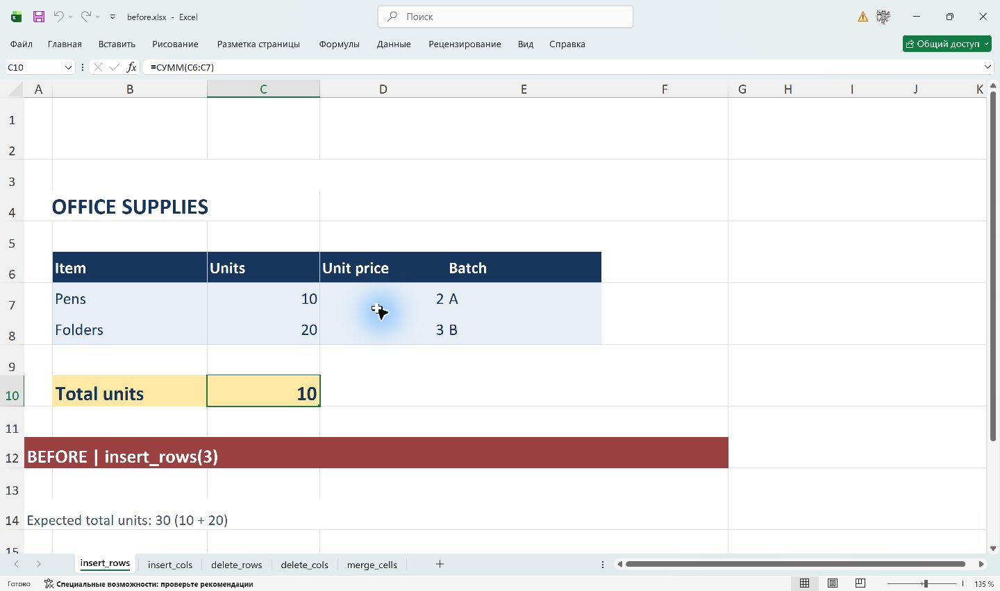
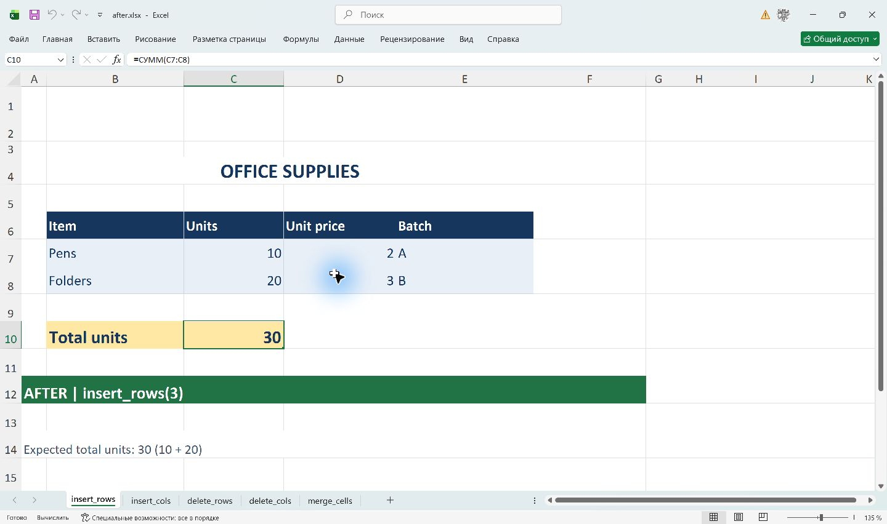
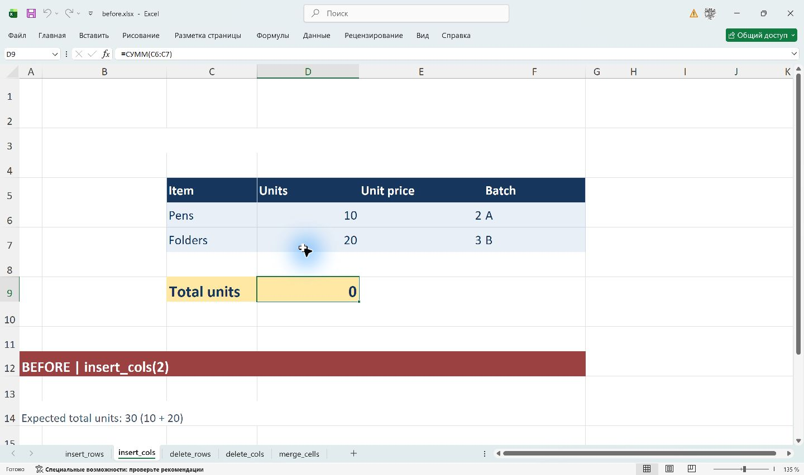
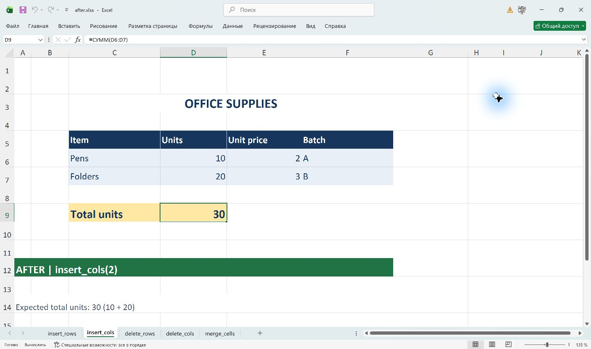
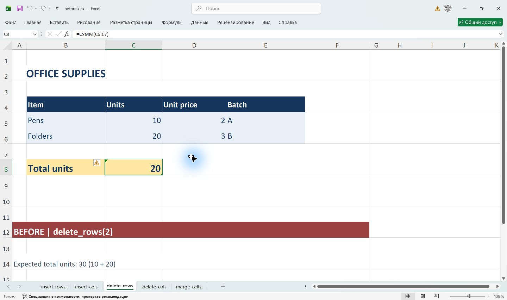
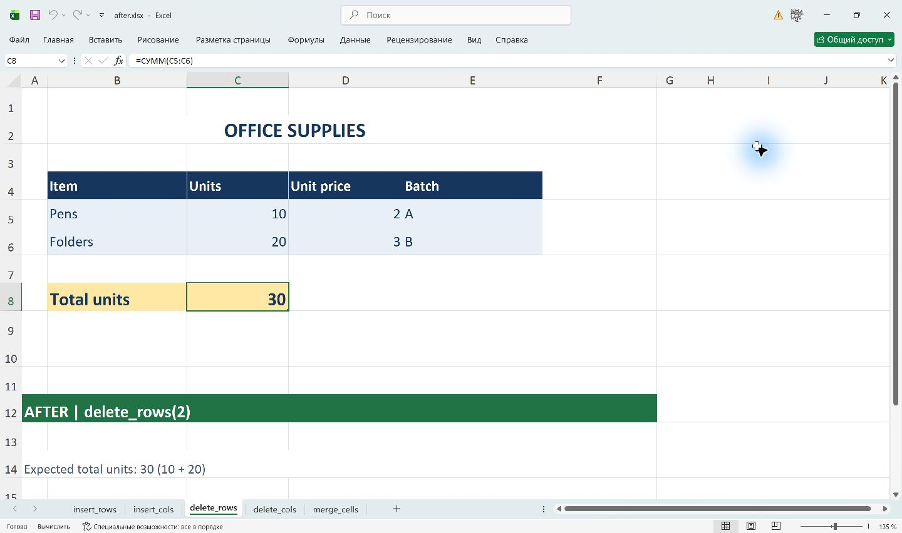
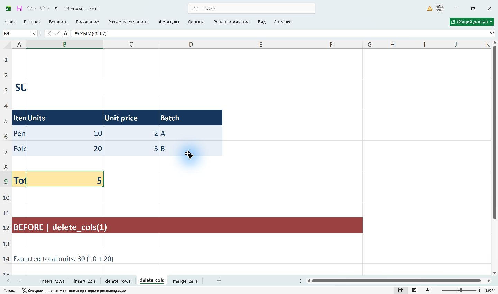
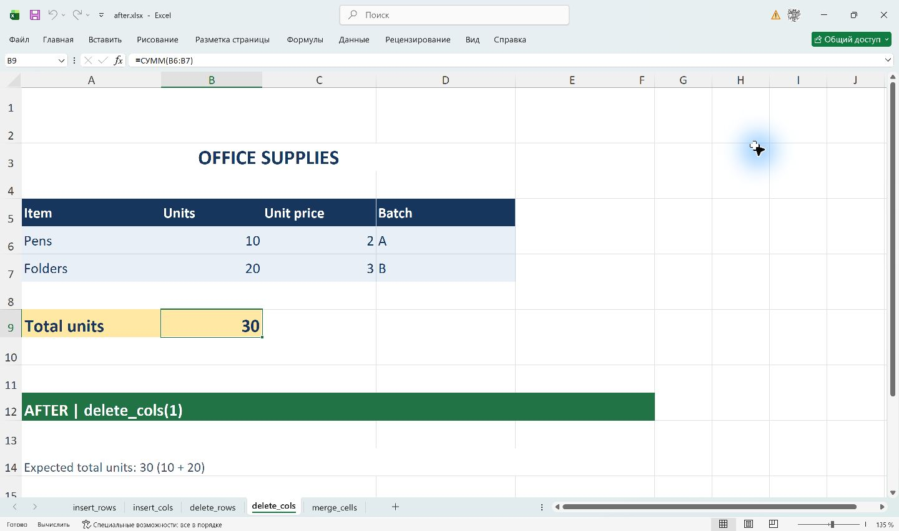
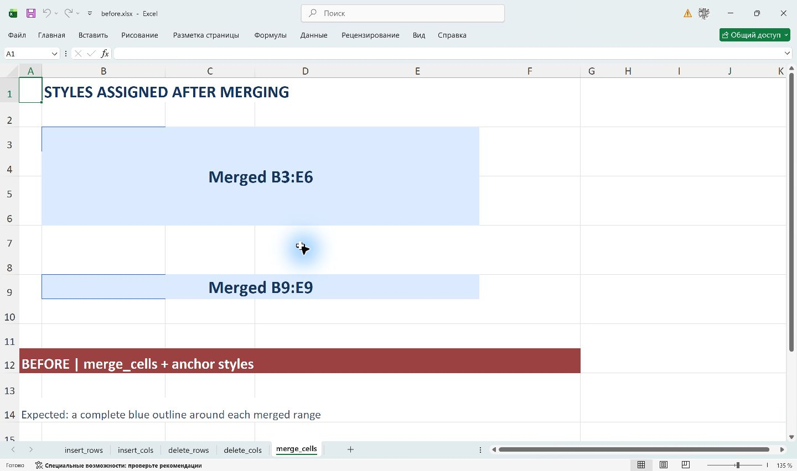
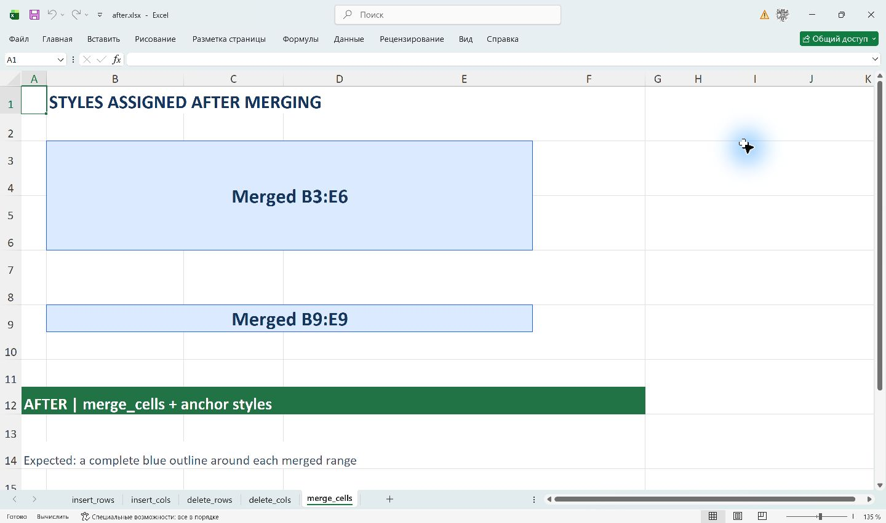

# openpyxl2

[English version](README.md)

**openpyxl2** — форк [openpyxl](https://foss.heptapod.net/openpyxl/openpyxl), библиотеки Python для чтения и записи файлов Excel `.xlsx`, `.xlsm`, `.xltx` и `.xltm`. Форк улучшает вставку и удаление строк и столбцов, обновляет ссылки в формулах и сохраняет оформление объединённых ячеек.

Имя пакета и имя для импорта остаются прежними: **`openpyxl`**. Требуется Python 3.8 или новее; матрица CI репозитория охватывает Python 3.8–3.14. В основе лежит ветка разработки upstream 3.2, а версия в коде — `3.2.0b2`.

## Установка и первая книга

Чтобы использовать форк, установите этот репозиторий в виртуальное окружение:

```sh
git clone https://github.com/EugeneRymarev/openpyxl2.git
cd openpyxl2
python -m pip install .
```

Команда `pip install openpyxl` из PyPI устанавливает оригинальную библиотеку. Форк использует то же имя дистрибутива, поэтому для сравнения устанавливайте их в разные окружения. Excel не нужен для создания и чтения файлов; табличный редактор понадобится для вычисления формул и просмотра результатов, показанных на скриншотах.

```python
from openpyxl import Workbook, load_workbook

wb = Workbook()
ws = wb.active
ws.title = "Sales"
ws.append(["Item", "Units"])
ws.append(["Pens", 10])
ws.append(["Folders", 20])
ws["B4"] = "=SUM(B2:B3)"
ws.insert_rows(2)  # Теперь B5 содержит =SUM(B3:B4).
wb.save("sales.xlsx")

loaded = load_workbook("sales.xlsx")
assert loaded["Sales"]["B5"].value == "=SUM(B3:B4)"
loaded.close()
```

## Скачивание wheel и публикация релизов

Workflow **Python package** собирает универсальный `py3-none-any.whl` и архив исходников (`.tar.gz`). После проверки wheel в чистом окружении оба файла сохраняются на 30 дней в артефакте **python-distributions** на странице запуска Actions. Сборки запускаются для push и pull request, указанных в workflow; вручную сборку можно запустить через **Actions → Python package → Run workflow**. Перед установкой распакуйте скачанный ZIP с артефактом:

```sh
python -m pip install /path/to/openpyxl-3.2.0b2-py3-none-any.whl
```

Укажите имя файла скачанной версии. Wheel подходит для Windows, Linux и macOS с поддерживаемыми версиями Python.

Для публикации пакетов в [GitHub Releases](https://github.com/EugeneRymarev/openpyxl2/releases):

1. Обновите `__version__` в `openpyxl/_constants.py` и закоммитьте изменение вместе с workflow.
2. Создайте и опубликуйте GitHub Release (или prerelease) из этого коммита. Тег должен совпадать с версией пакета; допустим префикс `v`, например `v3.2.0b2`. Сохранение черновика или отправка одного тега не публикует пакеты.
3. Workflow проверит тег, соберёт пакеты и выполнит матрицу тестов. После успешного завершения всех заданий тестирования и проверки wheel те же файлы `.whl` и `.tar.gz` появятся во вложениях релиза.

Загрузка использует автоматический `GITHUB_TOKEN` с правом `contents: write`; дополнительные секреты не нужны. Существующие вложения не перезаписываются: повторная публикация файлов с теми же именами завершится ошибкой. Коммит, на который указывает тег, должен содержать этот workflow. Имя дистрибутива и импорта остаётся `openpyxl`; загрузка в PyPI не выполняется.

## Отличия от оригинального openpyxl

Здесь форк сравнивается с исходной ревизией upstream, импортированной в его историю: [`1fa786a9d`](https://github.com/EugeneRymarev/openpyxl2/commit/1fa786a9dd5d77754d703f967832f5243e08ba0a). В примерах ниже используется ревизия форка `4c2bce2eb6f4682a1c3bafbb00e8802e3aac88a5`. Это воспроизводимое сравнение двух ревизий кода; оно не означает, что все выпуски оригинального openpyxl ведут себя одинаково.

- **Вставка и удаление строк и столбцов обновляют зависимости.** Методы `insert_rows`, `insert_cols`, `delete_rows` и `delete_cols` корректируют объединённые диапазоны, статические имена уровня книги и листа, области печати, повторяемые при печати строки и столбцы, высоты строк и ширины столбцов, включая сохранённые свойства скрытия, группировки и стиля. Поддерживаются имена, содержащие объединения ссылок и ссылки на целые строки или столбцы.
- **Формулы учитывают структурные изменения.** Прямые ссылки A1 в обычных формулах ячеек по всей книге и в вычисляемых именах обновляются, включая абсолютные и смешанные ссылки. Диапазоны расширяются или сужаются; полностью удалённые ссылки превращаются в `#REF!`. Знаки доллара по-прежнему управляют копированием, но не препятствуют структурным изменениям ссылок.
- **Объединения переживают частичное удаление.** Частично удалённый диапазон сужается и сохраняет содержимое и стиль исходной главной ячейки в новой левой верхней ячейке. Полностью удалённое объединение исчезает. Поддерживаются объединения из одной ячейки, а после изменения размера восстанавливаются внешние границы.
- **Изменения планируются до применения.** Проверки поддерживаемых ссылок и границ листа выполняются заранее. Реализация подготавливает изменения и откатывает их при ошибке применения. Разреженные листы остаются разреженными, сохранившиеся объекты `Cell` не заменяются новыми, а последующий `append()` использует обновлённую позицию на листе.
- **Стиль можно назначить после объединения.** Шрифт, заливка, выравнивание, защита, числовой формат и именованный стиль, назначенные левой верхней ячейке, распространяются на объединённый диапазон. Границы проецируются на его периметр, а главная ячейка хранит полное описание рамки. Замена или очистка её границ обновляет ранее нанесённые стороны. Явные изменения остальных объектов `MergedCell` остаются локальными.
- **Оформление объединённых ячеек сохраняется при загрузке.** Индивидуальные стили и явно заданная защита остальных ячеек объединения сохраняются при циклах записи и чтения. Недостающие границы восстанавливаются без замены сохранённых стилей. Объединение по-прежнему удаляет значения всех ячеек, кроме главной; восстановление этих данных при разъединении не предусмотрено.
- **Поиск объединения по координате.** `MultiCellRange.__getitem__`, в том числе `ws.merged_cells["C3"]`, возвращает содержащий ячейку диапазон как **строку координат**. Если координата не входит ни в один диапазон, возникает `CellNotMergedException`.
- **Сравнение именованных стилей по имени.** `NamedStyle` можно сравнить со строкой или другим `NamedStyle`. Сравниваются имена, а не свойства оформления. Другие типы операндов вызывают `NotNamedStyleOrStrException`.
- **Повторная привязка именованных стилей перед записью.** Индексы шрифтов, заливок, границ и остальных компонентов вычисляются для сохраняемой книги. Это предотвращает использование индексов из другой книги при повторном использовании объекта стиля. Такая привязка не делает совместно используемые изменяемые стили потокобезопасными.
- **Удалён псевдоним `openpyxl.open`.** Используйте `openpyxl.load_workbook`. Импорты также сделаны явными; импортируйте объекты из определяющих их модулей, не полагаясь на случайный реэкспорт.
- **Исправлены ошибки выполнения.** Правки затрагивают изменяемые аргументы по умолчанию и общее состояние, отсутствующие возвраты значений и бесполезные выражения, несовпадающие сигнатуры методов, ошибочные ссылки на переменные и классы, опечатки, перекрытие встроенных имён, импорт Decimal и построение кортежа числовых типов, а также сериализацию пространства имён в XML темы.
- **Исправлена работа XML-бэкендов.** Резервный `iterparse` из стандартной библиотеки доступен без необязательного `defusedxml`. XML-тесты используют выбранный парсер и подходящий байтовый ввод для lxml. Обновлены ограничения зависимостей, включая версии lxml и NumPy, совместимые с Python 3.14.
- **Перенесены исправления из upstream.** ZIP-потоки листов и архивы книг в обычном режиме закрываются на охваченных путях успешного выполнения и ошибок, что уменьшает утечки ресурсов и блокировки файлов в Windows. Поиск MIME-типа не зависит от регистра, при этом расширение в пакете сохраняется. Это перенесённые исправления оригинального проекта, а не уникальные возможности форка. После успешного открытия в режиме только для чтения книгу по-прежнему должен закрыть вызывающий код.
- **Обновлены инструменты разработки и проверки совместимости.** Код и импорты отформатированы Black и инструментами сортировки импортов; нормализованы окончания строк и конфигурация репозитория. Добавлены регрессионные проверки структурных изменений, формул, стилей объединённых ячеек, ресурсов и XML-бэкендов. CI охватывает Python 3.8–3.14, проверки 3.14 в Windows/Linux и установку собранного wheel без необязательных XML-пакетов.

Форк также наследует изменения ветки разработки upstream 3.2: модель `Coordinate` для координат ячеек, внешние подключения, элементы управления и volatile dependencies. Они входят в исходную базу и не являются самостоятельными добавлениями форка. История сравнения описана в [аудите upstream](doc/upstream-audit-2026-10-09.md).

## Как было и как стало в Microsoft Excel

Все десять изображений ниже — скриншоты **настоящих книг, открытых в Microsoft Excel для Windows**. Обе версии выполняют одинаковые операции Python над одинаковыми данными. «Раньше» означает зафиксированную ревизию оригинального openpyxl, «теперь» — этот форк. Сравниваются файлы, созданные библиотекой и открытые в Excel, а не команды вставки и удаления самого Excel.

Исходная таблица содержит 10 ручек и 20 папок. В `C9` записано `=SUM(C6:C7)`, поэтому ожидаемый итог — **30**. Заголовок объединён в диапазоне `B3:E3`. Каждый пример начинается с новой копии этой таблицы:

```python
from openpyxl import Workbook

wb = Workbook()
ws = wb.active
ws.merge_cells("B3:E3")
ws["B3"] = "OFFICE SUPPLIES"
for row, values in (
    (5, ["Item", "Units", "Unit price", "Batch"]),
    (6, ["Pens", 10, 2, "A"]),
    (7, ["Folders", 20, 3, "B"]),
):
    for column, value in enumerate(values, 2):
        ws.cell(row, column, value)
ws["B9"] = "Total units"
ws["C9"] = "=SUM(C6:C7)"
# Выполните одну из операций ниже и сохраните книгу.
```

[Полный генератор](doc/readme/build_examples.py) добавляет оформление, размеры строк и столбцов, определённые имена, области печати и поясняющие подписи со скриншотов. В установленной версии Excel строка формул показывает локализованное имя `СУММ`; внутри XLSX формула хранится с именем `SUM`.

### 1. `insert_rows`

```python
ws.insert_rows(3)
wb.save("insert_rows.xlsx")
```

Раньше ячейки перемещались, но формула в `C10` оставалась `=SUM(C6:C7)` и давала **10**, а объединение оставалось в `B3:E3`. Теперь формула становится `=SUM(C7:C8)` и даёт **30**, а объединённый заголовок перемещается в `B4:E4`.

| Раньше: оригинальный openpyxl                                                                  | Теперь: openpyxl2                                                                                          |
|------------------------------------------------------------------------------------------------|------------------------------------------------------------------------------------------------------------|
|  |  |

### 2. `insert_cols`

```python
ws.insert_cols(2)
wb.save("insert_cols.xlsx")
```

Раньше `D9` продолжала суммировать `C6:C7`, где уже находились названия товаров, и показывала **0**. Старое объединение `B3:E3` также скрывало перемещённый заголовок при открытии файла в Excel. Теперь `D9` суммирует `D6:D7` и показывает **30**; объединение перемещается в `C3:F3`, а размеры столбцов следуют за таблицей.

| Раньше: оригинальный openpyxl                                                                     | Теперь: openpyxl2                                                                           |
|---------------------------------------------------------------------------------------------------|---------------------------------------------------------------------------------------------|
|  |  |

### 3. `delete_rows`

```python
ws.delete_rows(2)
wb.save("delete_rows.xlsx")
```

Раньше формула перемещалась в `C8`, но сохраняла текст `=SUM(C6:C7)` и давала **20**. Заголовок оказывался вне своего объединения. Теперь `C8` содержит `=SUM(C5:C6)` и даёт **30**, а объединение перемещается в `B2:E2`.

| Раньше: оригинальный openpyxl                                                                  | Теперь: openpyxl2                                                                                          |
|------------------------------------------------------------------------------------------------|------------------------------------------------------------------------------------------------------------|
|  |  |

### 4. `delete_cols`

```python
ws.delete_cols(1)
wb.save("delete_cols.xlsx")
```

Раньше `B9` продолжала суммировать `C6:C7`, где после удаления находились цены, и давала **5**. Исходная узкая колонка A обрезала перемещённые подписи, а объединение оставалось в `B3:E3`. Теперь `B9` суммирует `B6:B7` и даёт **30**; объединение становится `A3:D3`, а ширины перемещаются вместе со столбцами.

| Раньше: оригинальный openpyxl                                                                | Теперь: openpyxl2                                                                            |
|----------------------------------------------------------------------------------------------|----------------------------------------------------------------------------------------------|
|  |  |

### 5. `merge_cells` и оформление после объединения

В этом отдельном примере стиль назначается главной ячейке **после** создания каждого объединения:

```python
from openpyxl import Workbook
from openpyxl.styles import Alignment, Border, Font, PatternFill, Side

wb = Workbook()
ws = wb.active
blue = Side(style="medium", color="FF2563EB")
for area, anchor in (("B3:E6", "B3"), ("B9:E9", "B9")):
    ws.merge_cells(area)
    cell = ws[anchor]
    cell.value = f"Merged {area}"
    cell.font = Font(name="Calibri", size=18, bold=True, color="FF17365D")
    cell.fill = PatternFill("solid", fgColor="FFDBEAFE")
    cell.alignment = Alignment(horizontal="center", vertical="center")
    cell.border = Border(left=blue, right=blue, top=blue, bottom=blue)
wb.save("merged.xlsx")
```

Раньше назначенные границы хранились только у главной ячейки, поэтому Excel показывал неполную рамку. Теперь и прямоугольное, и однострочное объединение получают **полную внешнюю рамку**. Excel и раньше показывал заливку главной ячейки и центрированный текст на всей площади объединения; видимое исправление в этом примере — границы. Дополнительно форк распространяет остальные свойства стиля на составляющие ячейки и сохраняет записанные стили при повторной загрузке.

| Раньше: оригинальный openpyxl                                                         | Теперь: openpyxl2                                                                  |
|---------------------------------------------------------------------------------------|------------------------------------------------------------------------------------|
|  |  |

### Как повторить сравнение

Скачайте [книгу оригинальной версии](doc/readme/workbooks/before.xlsx) и [книгу форка](doc/readme/workbooks/after.xlsx). В каждой пять листов с названиями демонстрируемых операций. Откройте их в Excel с пересчётом формул, чтобы увидеть итоги; сам openpyxl не вычисляет кэшированные результаты.

Чтобы заново создать книги, используйте копию репозитория с историей Git, содержащей исходную ревизию, и установленными зависимостями:

```sh
python doc/readme/build_examples.py
```

Скрипт извлекает зафиксированный код upstream во временный каталог, отдельно запускает его и текущую рабочую копию, затем проверяет формулы и различия границ. Ревизии кода, объединения, имена и области печати записываются в [provenance.json](doc/readme/provenance.json). Скриншоты снимаются отдельно в Excel; запуск скрипта не создаёт и не обновляет их. В [реестре снимков](doc/readme/screenshots.json) записаны размеры изображений и SHA-256 скриншотов и показанных книг. Обе книги содержат только вымышленные демонстрационные данные.

## Дополнительные примеры API

```python
from openpyxl import Workbook
from openpyxl.styles import NamedStyle

wb = Workbook()
ws = wb.active
ws.merge_cells("B2:D4")
assert ws.merged_cells["C3"] == "B2:D4"  # str, а не CellRange.

style = NamedStyle(name="Heading")
assert style == "Heading"
assert style == NamedStyle(name="Heading")  # Сравниваются только имена.
```

По умолчанию все четыре метода используют `update_dependencies=True` и `update_formulas=True`. Параметры позволяют существующим приложениям самостоятельно обслуживать часть зависимостей или все зависимости:

```python
ws.insert_rows(5, amount=2)  # Обновить поддерживаемые метаданные и формулы.
ws.insert_rows(5, amount=2, update_formulas=False)  # Сохранить текст формул.
ws.insert_rows(5, amount=2, update_dependencies=False)  # Прежнее перемещение ячеек.
```

Это альтернативные вызовы, а не последовательность из трёх операций над одним листом. `update_dependencies=False` отключает и переписывание формул. Те же параметры доступны у `insert_cols`, `delete_rows` и `delete_cols`.

## Возможности и ограничения

- Структурные изменения не обновляют таблицы, ссылки диаграмм и сводных таблиц, фильтры, проверку данных, условное форматирование, гиперссылки, рисунки, элементы управления и представления листа. `move_range` сохраняет собственное поведение. Правила работы с объединениями и размерами описаны в [документации по редактированию листов](doc/editing_worksheets.rst).
- Обновление формул поддерживает прямые ссылки A1 на ячейки и диапазоны, целые строки и столбцы, объединения и пересечения ссылок, а также `@` и ссылки на разлив в обычных строковых формулах. Ссылки на внешние книги и структурированные ссылки таблиц не меняются. Строки внутри `INDIRECT` остаются буквальным текстом; динамическая адресация не вычисляется.
- Обнаруженные неподдерживаемые конструкции — в том числе 3D-ссылки, имена и функции в границах диапазона, неразбираемые формулы и объекты формул массива или таблицы данных — вызывают `FormulaTranslationError` до изменения книги. Объекты формул массива и таблицы данных на любом листе блокируют операции с включённым обновлением формул. Токенизатор не является полной проверкой грамматики Excel.
- Имена уровня книги без указания листа не имеют однозначного контекста и остаются без изменений. Относительные имена используют сохранённые координаты A1; для предсказуемого обновления предпочтительны абсолютные ссылки. Распознавание синтаксиса разлива не означает обновление метаданных динамических массивов.
- Библиотека переписывает текст формул и запрашивает пересчёт, но не вычисляет формулы и не записывает их кэшированные результаты. Существующие настройки ручного и итеративного расчёта сохраняются. Каждая операция с обновлением формул просматривает созданные ячейки всей книги; граф зависимостей не ведётся.
- Защита XML подключается отдельно: при обработке недоверенного XML установите `defusedxml`. `lxml` — необязательный бэкенд, а не условие работы библиотеки.

Подробности реализации и результаты регрессионных проверок находятся в материалах о [поддержке формул](doc/issue-1273-formulas.md), [структурных изменениях](doc/issue-1273.md) и [границах объединённых ячеек](doc/issue-2024.md). Эти записи относятся к своим ревизиям; README описывает итоговое поведение после объединения изменений.

## Разработка, документация и лицензия

```sh
python -m pip install -r requirements.txt
python -m pip install -e .
python -m pytest
```

[Документация upstream](https://openpyxl.pages.heptapod.net/openpyxl/) описывает общий API. Отличия форка описаны в этом README и материалах каталога `doc/`. Сообщения об ошибках форка направляйте в [трекер openpyxl2](https://github.com/EugeneRymarev/openpyxl2/issues).

Проект распространяется по [лицензии MIT](LICENCE.rst). Авторы и участники оригинального openpyxl перечислены в [AUTHORS.rst](AUTHORS.rst); первоначально проект был вдохновлён PHPExcel.
